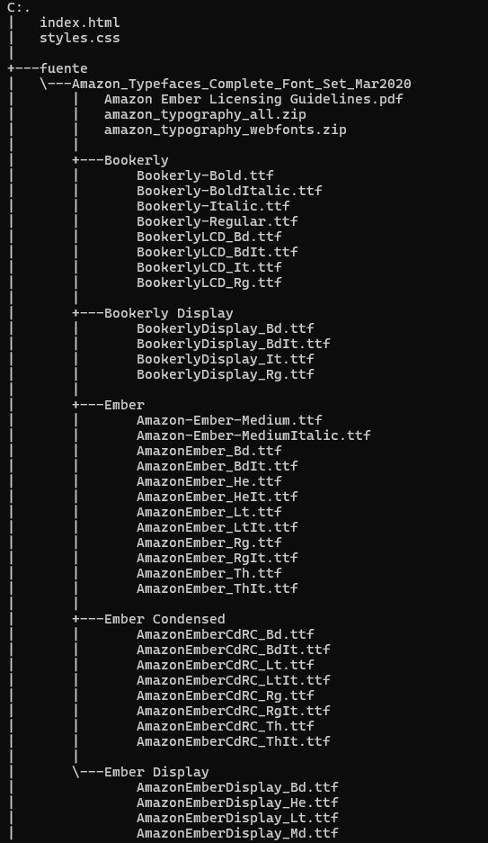
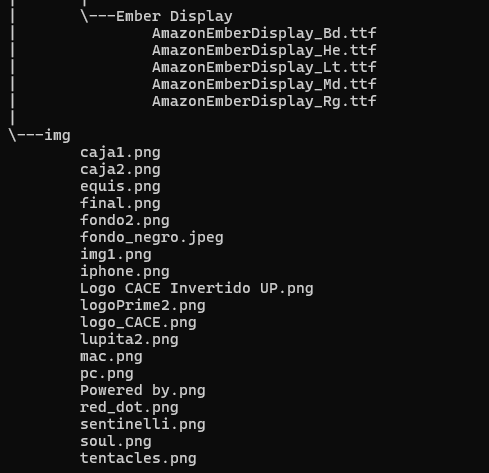

# HTML_Ortiz_Zully
Este repositorio consta de una carpeta llamada Dia4 donde contiene la creacion de un blog de Prime Entertainment de amazon.

## Descripción 

Esta carperta realice la maquetacion de la pagina Amazon donde contiene imagenes interactivas y varios bloques donde contiene informacion de la pagina. 

## Estructura 

* `fuente/`: Contiene fuentes personalizadas la cual los utilice para hacer la elaboración de la Pagina web.
* `img/`: Contiene todas las imagenes adicionadas a la pagina web.
* `index.html`: Elaboración de la estructura que conlleva la pagina.
* `styles.css`: Mejora de los estilos en la pagina.

## Caracteristicas

* Consta de imagenes interactivas para crear atracción visual en la pagina.
* En la parte superior contiene un login y un logo de busqueda donde no tiene funcionalidad.
* Contiene en la parte inferior informacion de los dispositivos compatibles para la pagina, donde solo es informacion por que la pagina no es responsive.

## Instrucciones de uso 

1. Clonar el repositorio o descargarlo.
2. Abrir el archivo index.html que se encuentra dentro del repositorio clonado o descargado.

## Créditos

Este proyecto fue elaborado por Zully Fernanda Ortiz Avendaño como objetivo de reforzar y mejorar mis conocimientos y habilidades en HTML y CSS.